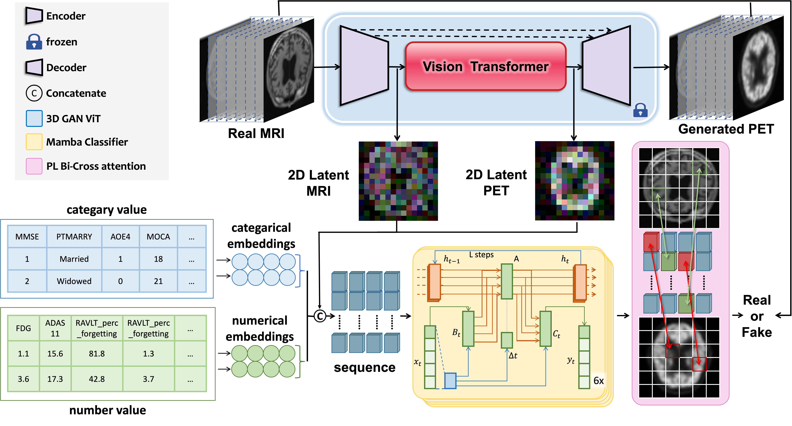

# **GFE-Mamba**
This code is the pytorch implementation of the **GFE-Mamba** which has been accepted by XX named "GFE-Mamba: Mamba-based AD Multi-modal Progression Assessment via Generative Feature Extraction from MCI". It can be used to accurately predict whether a patient will process to AD from MCI in a period (symbolled as $\Delta t$) with Multimodal (including MRI, PET and multiple scale assessments) information without the PET engagement. 

<br><br>

<br><br>

## Metrics of AD prediction on SOTA models on 1-year Dataset
| Method                                                                        | Precision        | Recall           | F1-score         | Accuracy         | MCC              |
|:-----------------------------------------------------------------------------:|:----------------:|:----------------:|:----------------:|:----------------:|:----------------:|
| Resnet50                                                 | 81.03\%          | 78.95\%          | 68.18\%          | 73.17\%          | 59.00\%          |
| Resnet101                                                | 79.31\%          | 47.37\%          | 81.82\%          | 60.00\%          | 50.57\%          |
| TabTransformer                              | 84.29\%          | 93.33\%          | 75.68\%          | 83.58\%          | 70.22\%          |
| XGBoost                                            | 88.14\%          | 86.53\%          | 86.92\%          | 87.37\%          | 73.90\%          |
| Qiu et al's     | 86.67\%          | 81.82\%          | 81.82\%          | 81.82\%          | 71.29\%          |
| Fusion model                                      | 89.83\%          | 88.21\%          | 88.91\%          | 89.87\%          | 78.06\%          |
| Zhang et al's | 76.67\%          | 83.33\%          | 45.45\%          | 58.82\%          | 48.42\%          |
| **GFE-GAN(Ours)**                                                        | **95.71%** | **93.33%** | **96.55%** | **94.92%** | **91.25%** |

## Pre-requisties
- Linux
- python==3.10
- NVIDIA GPU (memory>=14G) + CUDA cuDNN

## Python libraries
- accelerate == 0.27.2
- tqdm == 4.66.2
- monai == 1.3.0 
- monai-generative == 0.2.3
- torch == 2.0.0+cu118
- torchvision == 0.15.0+cu118
- matplotlib == 3.8.0
- PyYAML == 6.0.1
- einops == 0.7.0
- torchmetrics == 1.3.1
- torch-fidelity == 0.3.0

## How to train
### Preparation of the data
Because of ADNI's confidentiality policy, we are unable to directly publicize the acquired datasets here. However, we have provided detailed instructions on how to obtain the data, which can be found in 'GEF-Mamba_ADNI_Dataset\readme.md'.

### MRI to PET Generation training 
First, accordding to the dataloader, the MRI and PET should both be "nii.gz" files and should be put into one subdirectory. Then MRI and PET should be named as "MRI.nii.gz", "PET.nii.gz", repectively. 
```
|--MRI-PET
|----patient1
|------MRI.nii.gz
|------PET.nii.gz
|----patient2
|------MRI.nii.gz
|------PET.nii.gz
|----patient3
|------MRI.nii.gz
|------PET.nii.gz
...
```
After the configuration of directory, to make sure the "train_path" and "eval_path" have been specified. Then run the command.   
```
python main_gan_vit.py
```
### Prediction training
For this part, a MRI to PET generation network should be trained, a pre-trained [3D GAN-Vit](https://drive.google.com/drive/folders/1TMPE6JLMW87uMGIzYsbEZsgxmTArnlYE?usp=share_link) parameter could be downloaded and used. We assume that we have the table containing temporal information of whether one patient was diagnosed as MCI or AD. Since the program will read the temporal information and make a mapping to images, the name of MRI should be: 
```
[patient_name]-[diagnosis_time]-[label]
```
For example if a patient called 941_S_4187 is diagnosed at 2012_02_29_14_05_50.0 will not become AD next diagnosis, then this MRI is named as: 
```
941_S_4187-2012_02_29_14_05_50.0-0.nii.gz
```
Then run the command
```
python classify_mamba.py
```

## Model Evaluation 
Download the pre-trained [3D GAN-Vit](https://drive.google.com/drive/folders/1TMPE6JLMW87uMGIzYsbEZsgxmTArnlYE?usp=share_link) and [Mamba Classifier](https://drive.google.com/drive/folders/14JaBXYE3cxlyaVBluqwGQwLp-i5D-aNE?usp=share_link) parameters first and specify the yaml configuration file.: 
```
python test_mamba.py
```
## Citation
```
```


